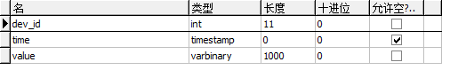
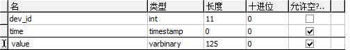
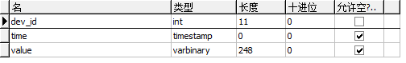
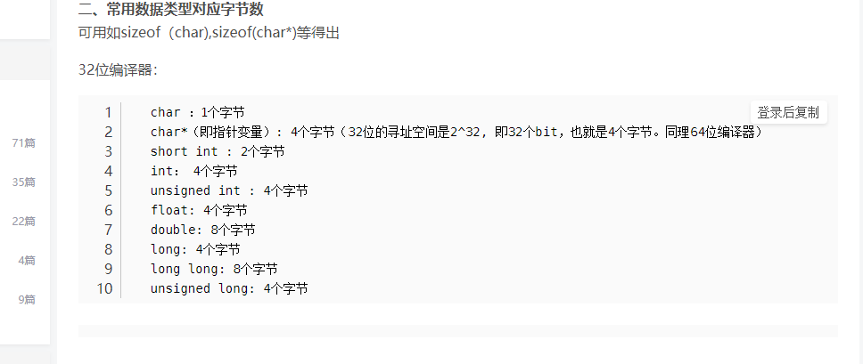

# 云端

1. 数据库中的数据格式
2. 确定需要发送的数据格式
3. 确定打包和解包的操作

## 1. 数据格式

确定数据库中的数据格式。

### 1.1 ECG

value存储的是每一秒钟存储的数据（单位是字节），因此根据ECG数据的大小和发送的频率可以确定需要的字节数是1000。

### 1.2 IBP2

这和ECG是类似的，也是存储每秒钟的数据，因此，根据数据每次采样的数据大小以及发送频率可以确定需要的字节为125。

### 1.3 SPO2

同理，数据长度为248字节。

## 2.发送数据的格式

有了数据库存储的数据之后，我们应该就可以确定要发送的数据格式了，以及什么时候该发送数据。

+ 每当数据存储满之后，发送数据，所以在设备端需要设置发送缓存。
+ 三种数据格式需要不用的缓存，此外，如何区分数据也是一个问题，或许还需要，上传设备的 ID 号码，以及本次数据的长度，或许还可以发送数据的类型，表明是哪个数据。

+ 接收端解析之后，运行对应的 SQL 语句讲数据插入进去即可

现在最关键的是确定发送数据的格式，到底该如何确定，QByteArray是我最终要的答案吗。

## 一些备用信息

