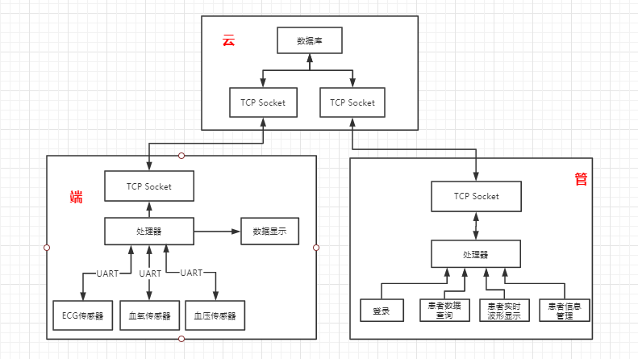
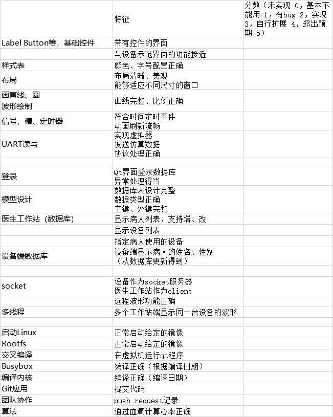
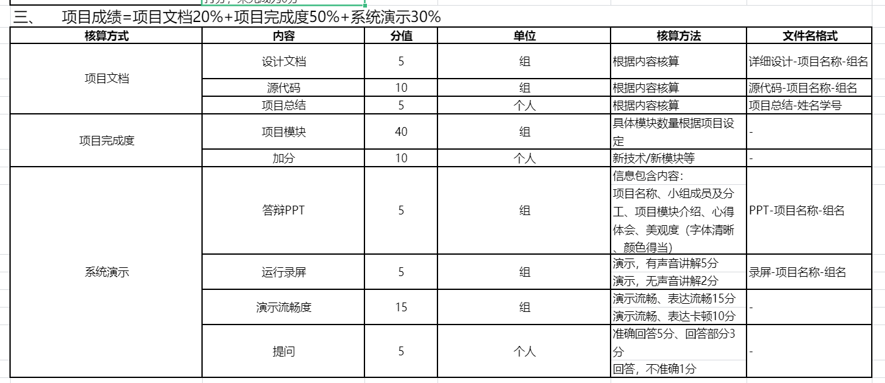
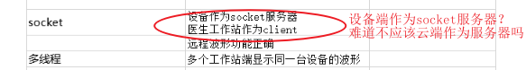
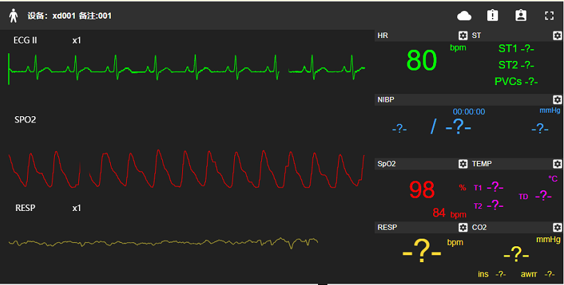
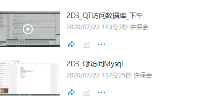
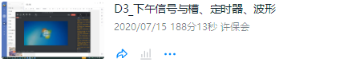

# 设计报告

设计文档中需要详细写明每一部分是如何实现的：

+ 结构框图

  比如这个，项目总体框图，每一个小的部分都可以细画出来

  

+ 函数以及接口的定义和返回值

主体任务：

## 1. 项目背景

这可以简单说下，抄一抄老师的内容就行了。

## 2. 端

- [ ] 张宇聪
- [ ] 张天祥
- [ ] 张久宁
- [ ] 陈竑海

- [x] 这部分比较简单，上课讲的内容基本上全部覆盖了我们需要做的，简单完善下即可

### 2.1 ARM从串口读取传感器数据

### 2.2 监护仪界面显示

+ 动态波形绘制，数据从串口中获取

  **这块的代码已经完成了**

+ 界面控件的摆放，需要显示动态波形，如下所示

  
  

### 2.3 数据上传到云

+ 这里应该不能直接连接本地数库，需要通过 TCP socket 在本地做一个回环，模拟上传到云端
+ 数据库的格式需要在[第三部分](#3.-云)提前沟通好

具体数据的格式可以放到云端部分设计好之后再进行。

+ Sql
+ TCP Socket

## 3. 云

主要是几个数据表的设计

### 3.1 数据模型设计

这一部分上课的时候已经完全覆盖到了，可以稍微完善下？这部分比较简单，做这个的可以配合做数据上传到云的人来完成。

+ 医生表

  维护医生的信息，用于第四部分医生管理端的登录

+ 病人信息表
+ 设备表
+ 实时数据表

### 3.2 访问 API 设计

数据库如何开放那些接口，如何进行访问是需要好好设计的，当然也可以瞎做，问题不大，毕竟这个比较简单。

+ 设备端和数据库交互（主要是向数据库中写入数据）
+ 管理端和数据库交互

看起来有两个部分，但是看名字就知道其实有很多部分都是可以重用的。

或者还是分开来写吧，更加清晰。

## 4. 管

- [ ] 刘金龙
- [ ] 王锦鹏
- [ ] 赵鹏飞

### 4.1 登录界面

### 4.2 操作管理患者信息

### 4.3 远程显示波形

这部分信息不用多描述，第第一个框图中已经给出来了。

