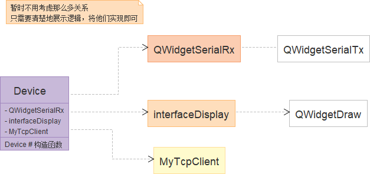

# 设备端

介绍设备端的设计思路，涉及到具体的类和函数，体现出整体的思路

## 1. 目标

+ 串口数据获取
  + ECG
  + SPO2
  + IBP2
+ 数据显示
  + 波形绘制
  + 其他一些数据
+ 数据发送（这部分由我来完成）
  + ECG
  + SPO2
  + IBP2

## 2. 整体结构

整体结构如图所示，当然还不够细化，这个结构是不能用来执行的。

## 3. 串口数据获取

为了接收三种不同的数据格式的数据，可以定义三个 QWidgetSerialRx，每个Rx处理不同的一种数据，他们都继承同一一个父类， QWidgetSerialRx， 分别关联到不同的串口发送端，Rx种应该有很多部件是可以重用的，但是我们是不是可以就做强耦合的，还是就做强耦合的吧，毕竟